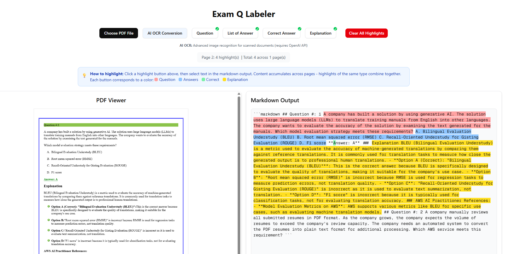
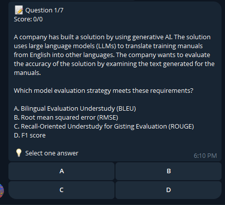

# ExamBot Data Labeler Web Application

## Screenshots

<div align="center">
  
  <p><em>Web Application - PDF Data Labeler and Management Interface</em></p>
  
  
  <p><em>Telegram Bot - Interactive Quiz Session</em></p>
</div>

## Overview

This project has evolved into a comprehensive AWS certification preparation and management ecosystem. It features a web-based PDF data labeler, robust user authentication, various management interfaces, and an interactive Telegram bot for quiz practice.

## Features

### Core Functionality

- **PDF Data Labeler**: Upload PDF documents, view them page by page, convert content to Markdown, and label specific sections (questions, answers, explanations) for quiz creation.
- **Analytics Dashboard**: Comprehensive dashboard with interactive charts and visual analytics showing certificate statistics, quiz performance trends over the last 30 days, user engagement metrics, and access code distribution with real-time data from completed Telegram bot quiz sessions.
- **User Authentication**: Secure user registration and login using Passkeys (WebAuthn) with JWT for session management.
- **Role-Based Access**: Protected routes ensure only authenticated users can access certain parts of the application.
- **Telegram Quiz Bot**: Interactive bot for AWS certification practice with real-time quiz sessions, progress tracking, and detailed explanations.

### Management Interfaces

- **Certificate Management**: CRUD operations for AWS certification types (e.g., SAA-C03, DVA-C02) with support for logo URLs and PDF certificate uploads via Cloudinary integration.
- **Payee Management**: Manage customer payment records, including credit card details (masked), payment status, and associated certificates.
- **Access Code Management**: Generate unique access codes for paid customers, linking them to specific certificates.
- **Question Assignment Management**: Assign and reorder specific questions from quizzes to generated access codes, allowing for customized quiz experiences per customer. Questions can be enabled/disabled for an access code.
- **Saved Questions Viewer**: Browse questions by certificate code or search by access code (original or generated) to view question details, options, and explanations.

### Telegram Bot Features

- **Interactive Quiz Sessions**: Real-time multiple-choice questions with A, B, C, D options
- **Certificate Selection**: Choose from available AWS certification types
- **Access Code Integration**: Validate generated access codes to access personalized quizzes
- **Instant Feedback**: Immediate results with detailed explanations for wrong answers
- **Progress Tracking**: Complete quiz statistics and performance monitoring
- **Bookmark System**: Save questions for later review with `/bookmark` command
- **Revision Mode**: Review previously answered questions to reinforce learning
- **Help System**: Comprehensive `/help` command with usage instructions

## Technologies Used

### Backend (Python - PDF Conversion Service)

- **Flask**: A micro web framework for Python.
- **docling**: A library for document processing and conversion.
- **pypdf**: A pure-Python PDF library.
- **Flask-Cors**: For handling Cross Origin Resource Sharing (CORS).

### Frontend (Next.js - Main Application)

- **Next.js**: A React framework for building production-ready web applications.
- **React**: A JavaScript library for building user interfaces.
- **MongoDB / Mongoose**: For database interactions and schema modeling.
- **jsonwebtoken**: For creating and verifying JSON Web Tokens.
- **@simplewebauthn/server & @simplewebauthn/browser**: For implementing FIDO2 (Passkey) authentication.
- **shadcn/ui**: A collection of re-usable components built using Radix UI and Tailwind CSS for a modern UI.
- **Tailwind CSS**: A utility-first CSS framework.
- **pdfjs-dist**: A PDF rendering library from Mozilla.
- **Chart.js & react-chartjs-2**: Modern charting library for creating interactive data visualizations and analytics dashboard.

### Telegram Bot (Node.js - Quiz Bot Service)

- **Grammy**: Modern Telegram bot framework for Node.js.
- **MongoDB**: Database integration for quiz data and progress tracking.
- **dotenv**: Environment configuration management.

## Setup and Installation

Follow these steps to set up and run the project locally.

### Prerequisites

- Node.js (LTS version recommended)
- pnpm (Package manager for Node.js - `npm install -g pnpm`)
- Python 3.8+ (or compatible version)
- pip (Python package installer)
- MongoDB instance (local or cloud-hosted)

### 1. Backend Setup (PDF Conversion Service)

1.  Navigate to the `backend` directory:
    ```bash
    cd backend
    ```

2.  Create a Python virtual environment:
    ```bash
    python3 -m venv venv
    ```

3.  Activate the virtual environment:
    - On macOS/Linux:
      ```bash
      source venv/bin/activate
      ```
    - On Windows:
      ```bash
      .\venv\Scripts\activate
      ```

4.  Install the required Python packages:
    ```bash
    pip install -r requirements.txt
    ```

5.  Run the Flask application:
    ```bash
    python app.py
    ```
    The backend server will start on `http://0.0.0.0:5000`.

### 2. Frontend Setup (Next.js Application)

1.  Navigate to the `frontend` directory:
    ```bash
    cd frontend
    ```

2.  **Environment Variables**: Create a `.env.local` file in the `frontend` directory and add the following:

    ```
    MONGODB_URI=your_mongodb_connection_string
    RP_ID=localhost # Or your domain (e.g., your-app.com)
    RP_NAME="AWS Cert Web" # Your application name
    ORIGIN=http://localhost:3000 # Your application's origin
    JWT_SECRET=your_super_secret_jwt_key # Generate a strong, random key
    NEXT_PUBLIC_PDF_CONVERSION_API_URL=http://localhost:5000 # URL of your Python backend
    ```
    *Replace placeholders with your actual values.*

3.  **Important: Copy PDF.js Worker File**
    Before installing dependencies, ensure the `pdf.worker.min.js` file is in your `public` directory. If it's not there, copy it manually:
    ```bash
    cp node_modules/pdfjs-dist/build/pdf.worker.min.js public/pdf.worker.min.js
    ```
    (Note: If `cp` fails, you might need to adjust the source path based on your `node_modules` structure or manually locate and copy the file.)

4.  Install Node.js dependencies:
    ```bash
    pnpm install
    ```

5.  **Initialize shadcn/ui**: Run the shadcn/ui initialization command. Follow the prompts, selecting `Default` style and `Slate` as the base color.
    ```bash
    npx shadcn@latest init
    ```

6.  **Add shadcn/ui Components**: Add the necessary UI components.
    ```bash
    npx shadcn@latest add button input label avatar badge card select separator sheet
    ```

7.  **Seed Database (Optional but Recommended)**: Populate your MongoDB with sample data for certificates, payees, and question assignments.
    ```bash
    node seed-certificates.js
    node seed-payees.js
    node seed-access-code-questions.js
    ```

8.  Run the Next.js development server:
    ```bash
    pnpm dev
    ```
    The frontend application will be accessible at `http://localhost:3000`.

### 3. Telegram Bot Setup (Quiz Bot Service)

1.  Navigate to the `telegram-bot` directory:
    ```bash
    cd telegram-bot
    ```

2.  **Environment Variables**: Create a `.env` file in the `telegram-bot` directory and add the following:
    ```
    BOT_TOKEN=your_telegram_bot_token_from_botfather
    MONGODB_URI=your_mongodb_connection_string
    ```
    *Get your bot token from [@BotFather](https://t.me/botfather) on Telegram.*

3.  Install Node.js dependencies:
    ```bash
    npm install
    ```

4.  Run the Telegram bot:
    ```bash
    node bot.js
    ```
    The bot will start and be available on Telegram.

## Usage

### Web Application

1.  Ensure both the backend (Flask) and frontend (Next.js) servers are running.
2.  Open your web browser and go to `http://localhost:3000`.
3.  **Login/Register**: You will be greeted by the login page. You can register a new user using a passkey.
4.  **Navigation**: After successful login, you will be redirected to the analytics dashboard. Use the sliding menu (accessible from the top-left corner) to navigate to different sections:
    -   **Home**: Analytics dashboard with interactive charts and key metrics.
    -   **Exam Q Labeler**: The PDF Data Labeler interface for processing documents.
    -   **Certificates**: Manage certification types.
    -   **Payees**: Manage customer payment records.
    -   **Access Codes**: Generate and view access codes for paid customers.
    -   **Manage Questions**: Assign and reorder questions for specific generated access codes.
    -   **Saved Questions**: Search and view questions by access code or certificate.

### Telegram Bot

1.  Ensure the bot is running (`node bot.js` in the `telegram-bot` directory).
2.  Find your bot on Telegram using the username you set with BotFather.
3.  **Start a Quiz Session**: Send `/start` to begin
4.  **Available Commands**:
    -   `/start` - Start new quiz session
    -   `/help` - Show comprehensive help guide
    -   `/bookmark <number>` - Save question for later review
    -   `/bookmarks` - View saved bookmarks
    -   `/revision` - Review previously answered questions

## Important Notes

-   **Passkey Challenge Storage**: The current implementation uses a global variable for storing WebAuthn challenges (`currentChallenge`). **This is for demonstration purposes only and is highly insecure.** In a production environment, you must implement a secure server-side session management system (e.g., using a database, Redis, or a dedicated session library) to store and retrieve challenges.
-   **PDF Conversion API**: The `NEXT_PUBLIC_PDF_CONVERSION_API_URL` environment variable in the frontend points to your Python Flask backend. Ensure this URL is correct.
-   **Data Transformation**: The application includes utilities (`frontend/app/utils/questionTransform.ts`) to handle transformations between different question data formats from the database to the frontend.

## Documentation

This project includes comprehensive technical documentation organized in the `frontend/specs/` folder. Below is a complete reference to all available documentation:

| Document | Description | Category |
|----------|-------------|----------|
| [ACCESS_CODE_QUESTIONS_LINKING.md](./frontend/specs/ACCESS_CODE_QUESTIONS_LINKING.md) | **Complete access code questions linking system documentation** | **Features** |
| [ACCESS_CODE_QUESTIONS_README.md](./frontend/specs/ACCESS_CODE_QUESTIONS_README.md) | Documentation for access code questions functionality | Features |
| [HELP_COMMAND_IMPLEMENTATION.md](./telegram-bot/HELP_COMMAND_IMPLEMENTATION.md) | Telegram bot help command implementation guide | Telegram Bot |
| [OCR_FEATURE_README.md](./frontend/specs/OCR_FEATURE_README.md) | **PDF-to-Markdown OCR conversion feature using OpenAI's vision API** | **Features** |
| [QUESTION_STRUCTURE_ANALYSIS.md](./telegram-bot/QUESTION_STRUCTURE_ANALYSIS.md) | Analysis of question data structure and bot compatibility issues | Telegram Bot |
| [TELEGRAM_BOT_README.md](./telegram-bot/README.md) | **Telegram bot setup, features, and implementation guide** | **Telegram Bot** |
| [AI_CACHING_COMPLETE.md](./frontend/specs/AI_CACHING_COMPLETE.md) | AI response caching implementation completion guide | AI Implementation |
| [AI_CACHING_IMPLEMENTATION_SUMMARY.md](./frontend/specs/AI_CACHING_IMPLEMENTATION_SUMMARY.md) | Summary of AI caching implementation details | AI Implementation |
| [AI_EXPLANATION_SETUP.md](./frontend/specs/AI_EXPLANATION_SETUP.md) | Setup guide for AI explanation features | AI Implementation |
| [AI_IMPLEMENTATION_COMPLETE.md](./frontend/specs/AI_IMPLEMENTATION_COMPLETE.md) | Complete AI second opinion feature implementation guide | AI Implementation |
| [AI_SETUP_COMPLETE.md](./frontend/specs/AI_SETUP_COMPLETE.md) | AI setup completion documentation | AI Implementation |
| [APPLICATION_FLOW_DIAGRAM.md](./frontend/specs/APPLICATION_FLOW_DIAGRAM.md) | **Comprehensive application architecture and flow diagram** | **Architecture** |
| [DATA_TRANSFORMATION_IMPLEMENTATION.md](./frontend/specs/DATA_TRANSFORMATION_IMPLEMENTATION.md) | Data transformation implementation details | Backend |
| [IMPLEMENTATION_COMPLETE.md](./frontend/specs/IMPLEMENTATION_COMPLETE.md) | Overall project implementation completion status | Project Status |
| [IMPLEMENTATION_SUCCESS.md](./frontend/specs/IMPLEMENTATION_SUCCESS.md) | Implementation success documentation | Project Status |
| [JWT_AUTHENTICATION_COMPLETE.md](./frontend/specs/JWT_AUTHENTICATION_COMPLETE.md) | JWT authentication implementation guide | Authentication |
| [JWT_AUTHENTICATION_FIX_SUMMARY.md](./frontend/specs/JWT_AUTHENTICATION_FIX_SUMMARY.md) | JWT authentication fixes and solutions | Authentication |
| [LOCAL_DEVELOPMENT_FIX.md](./frontend/specs/LOCAL_DEVELOPMENT_FIX.md) | Local development environment fixes | Development |
| [LOGIN_DEBUG_ANALYSIS.md](./frontend/specs/LOGIN_DEBUG_ANALYSIS.md) | Login functionality debug analysis | Authentication |
| [LOGIN_NAVIGATION_FIX.md](./frontend/specs/LOGIN_NAVIGATION_FIX.md) | Login navigation fixes and improvements | Authentication |
| [MARKDOWN_VISUAL_GUIDE.md](./frontend/specs/MARKDOWN_VISUAL_GUIDE.md) | Visual guide for markdown rendering | UI/UX |
| [NAVIGATION_FIX_COMPLETE.md](./frontend/specs/NAVIGATION_FIX_COMPLETE.md) | Navigation system fixes completion | UI/UX |
| [REACT_MARKDOWN_COMPLETE.md](./frontend/specs/REACT_MARKDOWN_COMPLETE.md) | React markdown implementation completion | UI/UX |
| [REACT_MARKDOWN_IMPLEMENTATION.md](./frontend/specs/REACT_MARKDOWN_IMPLEMENTATION.md) | React markdown implementation details | UI/UX |
| [SLIDING_MENU_LOGOUT_FIX.md](./frontend/specs/SLIDING_MENU_LOGOUT_FIX.md) | Sliding menu logout functionality fixes | UI/UX |
| [TITLE_CONFIGURATION_FIX.md](./frontend/specs/TITLE_CONFIGURATION_FIX.md) | Title configuration fixes and updates | Configuration |
| [VERCEL_AI_COMPLETE_SETUP.md](./frontend/specs/VERCEL_AI_COMPLETE_SETUP.md) | Complete Vercel AI setup guide | AI Implementation |
| [VERCEL_AI_SETUP.md](./frontend/specs/VERCEL_AI_SETUP.md) | Vercel AI initial setup documentation | AI Implementation |
| [VERCEL_API_KEY_SETUP.md](./frontend/specs/VERCEL_API_KEY_SETUP.md) | Vercel API key setup instructions | Configuration |

### Documentation Categories

- **Architecture**: Complete system architecture, flow diagrams, and technical specifications
- **AI Implementation**: Documentation related to AI features, caching, and Vercel AI integration
- **Authentication**: JWT authentication, login functionality, and security implementations
- **UI/UX**: User interface components, navigation, and markdown rendering
- **Configuration**: Environment setup, API keys, and configuration management
- **Features**: Specific application features and functionality
- **Backend**: Data transformation and backend implementation details
- **Development**: Local development setup and debugging guides
- **Project Status**: Overall implementation status and completion documentation
- **Telegram Bot**: Telegram bot implementation, commands, and data structure analysis

### Quick Reference

For developers new to the project, we recommend starting with these key documents:

1. **[APPLICATION_FLOW_DIAGRAM.md](./frontend/specs/APPLICATION_FLOW_DIAGRAM.md)** - Complete system architecture overview
2. **[TELEGRAM_BOT_README.md](./telegram-bot/README.md)** - Telegram bot setup and features guide
3. **[JWT_AUTHENTICATION_FIX_SUMMARY.md](./frontend/specs/JWT_AUTHENTICATION_FIX_SUMMARY.md)** - Authentication implementation details
4. **[AI_IMPLEMENTATION_COMPLETE.md](./frontend/specs/AI_IMPLEMENTATION_COMPLETE.md)** - AI features and setup guide
5. **[OCR_FEATURE_README.md](./frontend/specs/OCR_FEATURE_README.md)** - PDF-to-Markdown OCR conversion using OpenAI
6. **[LOCAL_DEVELOPMENT_FIX.md](./frontend/specs/LOCAL_DEVELOPMENT_FIX.md)** - Development environment troubleshooting

## Contributing

Feel free to fork this repository, open issues, or submit pull requests.

## License

This project is open-sourced under the MIT License.
