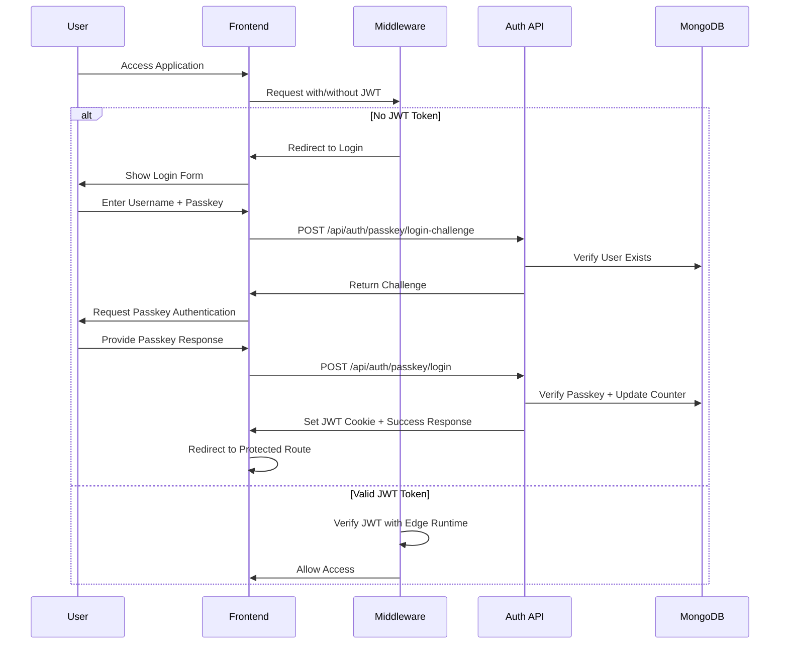
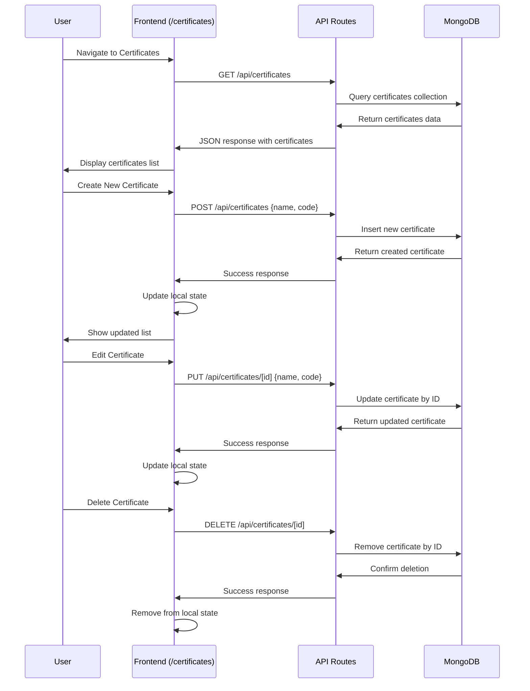
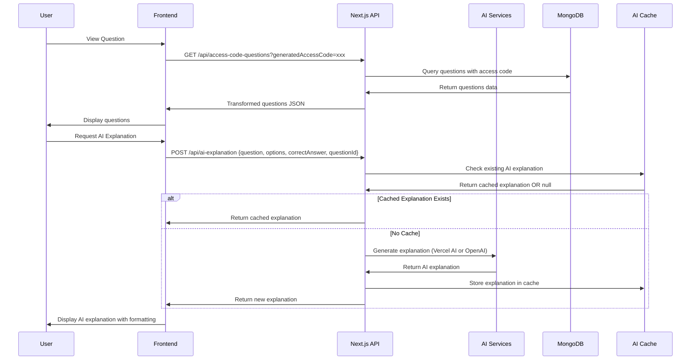
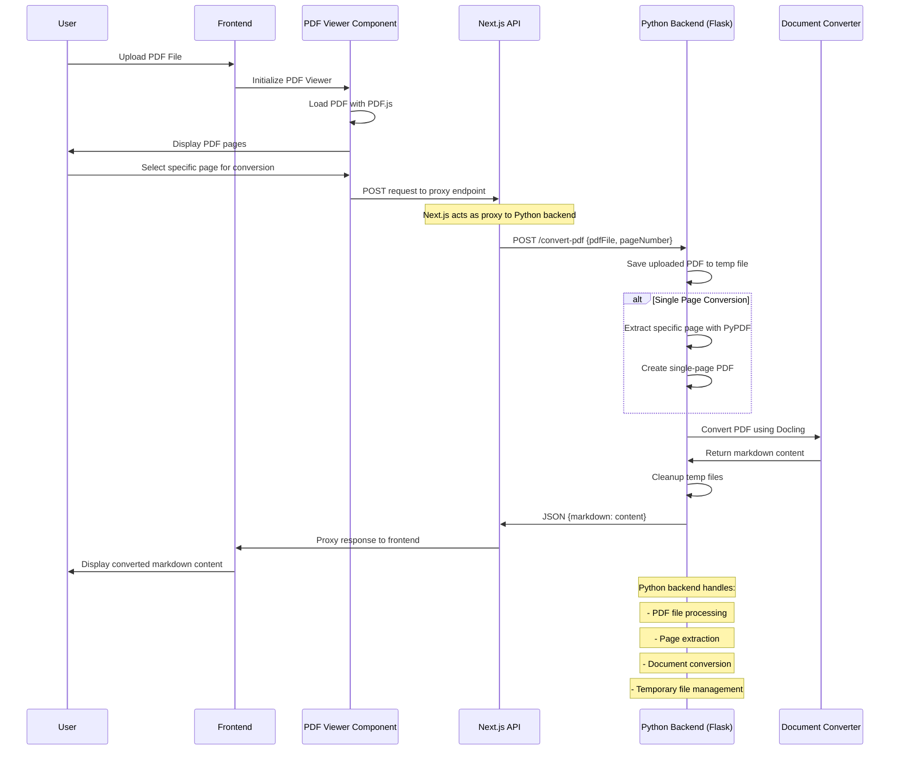
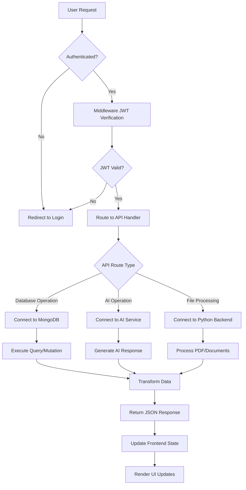

# AWS Cert Web Application - Comprehensive Flow Diagram

## Overview

This document provides a detailed application flow diagram showing the complete data flow from the React frontend through Next.js API routes to the Python backend, including authentication, data processing, and user interactions.

## Architecture Overview

```
┌─────────────────┐    ┌──────────────────┐    ┌─────────────────┐
│   Frontend      │    │   Next.js API    │    │ Python Backend  │
│   (React/Next)  │◄──►│   Routes         │◄──►│   (Flask)       │
└─────────────────┘    └──────────────────┘    └─────────────────┘
│                      │                      │
│ • User Interface     │ • Authentication     │ • PDF Processing
│ • State Management   │ • Business Logic     │ • Document Convert
│ • Client Routing     │ • Database Ops       │ • File Management
│ • Form Handling      │ • API Orchestration  │
└─────────────────────┘└─────────────────────┘└─────────────────┘
```

## Technology Stack

### Frontend (Next.js 15)
- **Framework**: Next.js 15 with React 18
- **Authentication**: Passkey Authentication (WebAuthn)
- **State Management**: React Hooks + Context
- **UI Components**: Radix UI + Tailwind CSS
- **PDF Viewing**: PDF.js
- **HTTP Client**: Fetch API

### Backend Services
- **API Layer**: Next.js API Routes (Edge Runtime Compatible)
- **Database**: MongoDB with Mongoose ODM
- **Authentication**: JWT + Edge Runtime Compatible Verification
- **File Processing**: Python Flask Service

### Python Backend
- **Framework**: Flask with CORS
- **PDF Processing**: Docling + PyPDF
- **Document Conversion**: PDF to Markdown conversion

## Detailed Application Flow

### 1. Authentication Flow



### 2. Certificate Management Flow



### 3. Question Management & AI Explanation Flow



### 4. PDF Processing Flow (Frontend → Next.js → Python)



### 5. Data Access Pattern Flow



## API Endpoints Reference

### Authentication Endpoints
- `POST /api/auth/passkey/register-challenge` - Generate registration challenge
- `POST /api/auth/passkey/register` - Complete passkey registration
- `POST /api/auth/passkey/login-challenge` - Generate login challenge
- `POST /api/auth/passkey/login` - Complete passkey authentication
- `POST /api/auth/logout` - Clear authentication
- `GET /api/auth/verify` - Verify current authentication

### Certificate Management
- `GET /api/certificates` - List all certificates
- `POST /api/certificates` - Create new certificate
- `PUT /api/certificates/[id]` - Update certificate
- `DELETE /api/certificates/[id]` - Delete certificate
- `GET /api/certificates/[id]/next-question-no` - Get next question number

### Question Management
- `GET /api/access-code-questions` - Get questions by access code
- `POST /api/access-code-questions` - Create/update questions
- `GET /api/saved-questions` - Get saved questions
- `POST /api/save-quiz` - Save quiz results

### AI & Processing
- `POST /api/ai-explanation` - Generate AI explanations for questions
- External: `POST :5000/convert-pdf` - Python backend PDF conversion

### Administrative
- `GET /api/payees` - Manage payees
- `POST /api/payees` - Create payee
- `PUT /api/payees/[id]` - Update payee
- `DELETE /api/payees/[id]` - Delete payee

## Security Implementation

### Authentication Security
- **Passkey Authentication**: WebAuthn standard for secure passwordless login
- **JWT Tokens**: Signed with HMAC-SHA256, 1-hour expiration
- **Edge Runtime Compatible**: Custom JWT verification for Next.js middleware
- **HTTP-Only Cookies**: Secure token storage, not accessible via JavaScript
- **CORS Protection**: Configured for specific origins

### Authorization Patterns
```typescript
// All protected routes use withAuth HOC
export const GET = withAuth(async (request: AuthenticatedRequest) => {
  // Route handler has access to authenticated user
  const userId = request.user.userId;
  // Business logic here
});
```

### Data Validation
- **Input Sanitization**: All API inputs validated and sanitized
- **MongoDB Injection Protection**: Parameterized queries with Mongoose
- **File Upload Security**: Temporary file handling with cleanup
- **Rate Limiting**: Implemented at API route level

## Database Schema Overview

### Collections Structure
```javascript
// Users Collection
{
  _id: ObjectId,
  username: String,
  passkeys: [{
    credentialID: String,
    credentialPublicKey: Buffer,
    counter: Number,
    credentialDeviceType: String,
    credentialBackedUp: Boolean,
    transports: [String]
  }],
  createdAt: Date
}

// Certificates Collection
{
  _id: ObjectId,
  name: String,
  code: String (unique),
  createdAt: Date,
  updatedAt: Date
}

// Access Code Questions Collection
{
  _id: ObjectId,
  generatedAccessCode: String,
  questionNumber: Number,
  question: String,
  options: [String],
  correctAnswer: Number,
  explanation: String,
  certificateCode: String,
  enabled: Boolean,
  aiExplanation: String,
  createdAt: Date,
  updatedAt: Date
}

// AI Explanations Cache
{
  _id: ObjectId,
  questionId: ObjectId,
  explanation: String,
  createdAt: Date,
  expiresAt: Date
}
```

## Environment Configuration

### Frontend Environment Variables
```bash
# Database
MONGODB_URI=mongodb://localhost:27017/awscert

# Authentication
JWT_SECRET=your_super_secret_jwt_key
RP_ID=localhost
RP_NAME="AWS Cert Web"
ORIGIN=http://localhost:3000

# External Services
NEXT_PUBLIC_PDF_CONVERSION_API_URL=http://localhost:5000
VERCEL_API_KEY=your_vercel_api_key
OPENAI_API_KEY=your_openai_api_key

# Development
NEXT_DISABLE_OVERLAY=true
```

### Python Backend Configuration
```python
# Flask Configuration
app.debug = True
CORS(app)  # Enable CORS for all routes
host='0.0.0.0', port=5000
```

## Performance Considerations

### Frontend Optimizations
- **Code Splitting**: Automatic route-based code splitting
- **Image Optimization**: Next.js Image component
- **Caching**: API response caching with revalidation
- **Lazy Loading**: PDF components loaded on demand

### Backend Optimizations
- **Connection Pooling**: MongoDB connection reuse
- **AI Response Caching**: Cached explanations to reduce API calls
- **File Processing**: Temporary file cleanup
- **Edge Runtime**: Faster middleware execution

### Python Service Optimizations
- **Temporary File Management**: Automatic cleanup
- **Memory Management**: Efficient PDF processing
- **Error Handling**: Comprehensive error catching and logging

## Development Workflow

### Local Development Setup
1. **Frontend**: `npm run dev` (Port 3001)
2. **Python Backend**: `python app.py` (Port 5000)
3. **MongoDB**: Local instance on port 27017

### Testing Strategy
- **Authentication Flow**: Comprehensive passkey testing
- **API Endpoints**: Individual endpoint testing
- **PDF Processing**: End-to-end file processing tests
- **Database Operations**: CRUD operation verification

## Deployment Architecture

### Production Flow
```
User → CDN/Load Balancer → Next.js Frontend → Next.js API → MongoDB
                                           → Python Backend → Document Processing
                                           → AI Services → Response Generation
```

### Scalability Considerations
- **Horizontal Scaling**: Multiple Next.js instances
- **Database Scaling**: MongoDB replica sets
- **File Processing**: Queue-based PDF processing
- **Caching Layer**: Redis for session/data caching

---

*This diagram represents the current state of the AWS Cert Web application as of July 2025. For specific implementation details, refer to the codebase and individual component documentation.*
